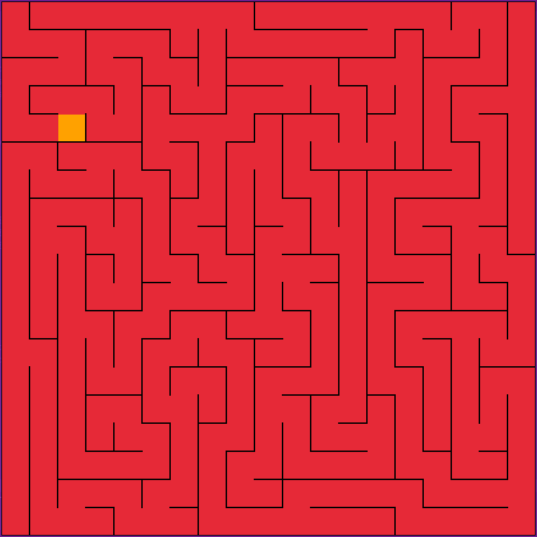
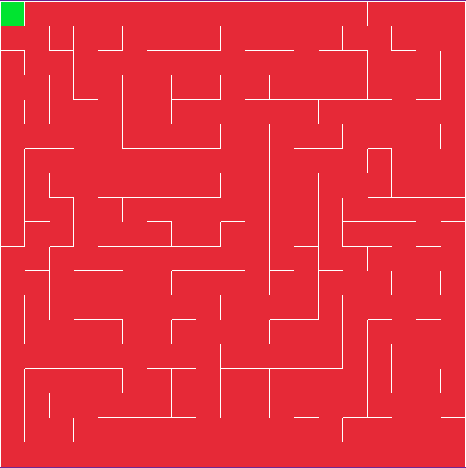
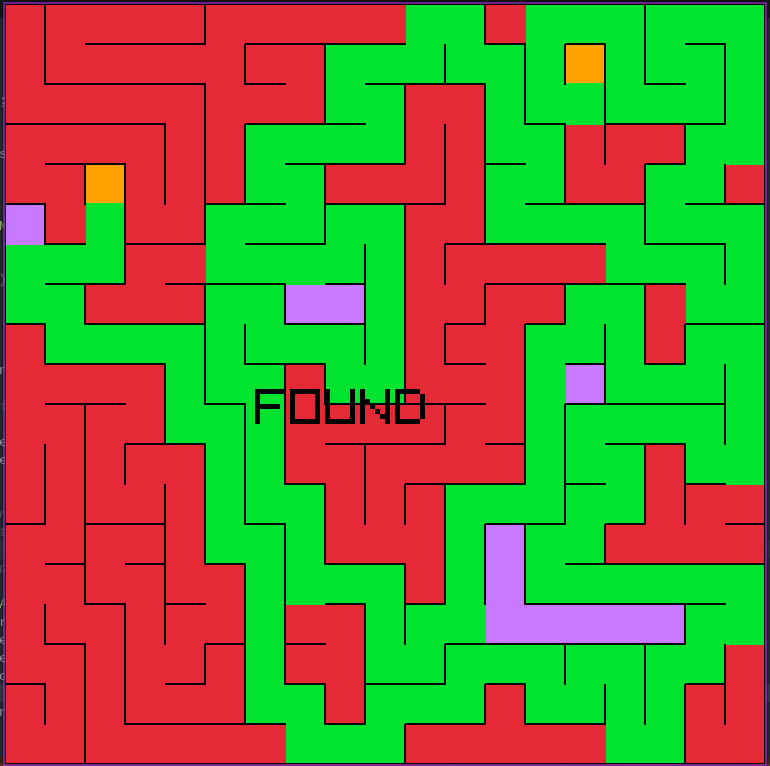

# MazeGenerator-CPP-Raylib

## Description

Welcome to the MazeGenerator-CPP-Raylib repository! This project is a maze generator program 💻 implemented in C++ and powered by the Raylib library. It provides a fascinating exploration of maze creation algorithm with graphical visualization.

## Key Features

* **Maze Generation:** This program employs maze generation algorithm with dynamic size of maze by using backtracking concept.
* **Graphical Visualization:** Raylib brings life to the mazes with vibrant graphics, providing an immersive and visually appealing experience.
* **DFS Path Finding Algorithm:** This program employs path finding algorithm using DFS algorithm. You can visualize it by looking at it.

## Getting Started

**To try out this maze generator**  
1. Clone this repository to you local machine.
2. Install the necessary dependencies, including C++ compiler and Raylib.
3. Compile and run the program using ```make``` command.

## Screenshots





## Contributing

I welcome contributions! Feel free to report issues, suggest improvements, or submit you own enhancements.

## License

The project is open-source and available under the [MIT License](./liscense)
